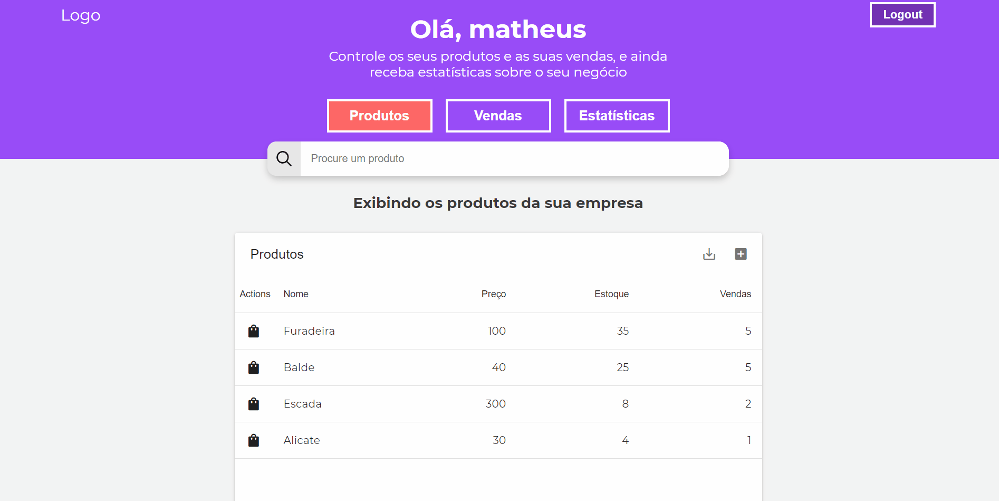

# Teste-Inhalt
Esta aplicação foi construída para o processo seletivo de estágio na Inhalt, e consiste em controlar as vendas e o estoque de produtos. Adicionei uma sessão para estatísticas das vendas exibindo o total arrecadado com as vendas, o total de produtos vendidos e um gráfico doughnut com os 5 produtos mais vendidos.



## Funcionalidades
* Cadastro de usuário;
* Login (Autenticação e autorização com token JWT);
* Listagem de produtos;
* Cadastro de novos produtos;
* Busca de produtos pelo título;
* Venda de produtos (com controle e validação de estoque);
* Histórico de vendas (Bônus);
* Export dos dados das vendas e produtos para PDF e CSV (Bônus);
* Estatísticas das vendas (Bônus);

## Tecnologias utilizadas
### Front-end:
* React JS;
* SASS para estilos;
* Material table;
* Chart JS;
* Axios;

### Back-end (API Rest):
* .Net Core 3.1;
* Banco de dados InMemory;

## Observações
* Para visualizar as estatísticas é necessário vender pelo menos 5 produtos diferentes;
* Não é possível vender um produto que não está disponível no estoque;
* Há uma opção nas tabelas pra exportar o contéudo em PDF ou CSV;
* Como a API foi construída utilizando um banco de dados InMemory, a reinicialização da mesma acarreta na perda dos dados registrados;

## Procedimentos para rodar a aplicação localmente
Primeiramente, baixe o repositório
```zsh
  git clone https://github.com/matheusmosca/teste-inhalt.git
  cd teste-inhalt
  # Ou baixe o arquivo ZIP
```
### Front-end
Pré-requisitos:
* Nodejs 12.18.2 ou superior (LTS);
* Yarn 1.22.4
```zsh
  # Caso não tenha yarn instalado é possível instalar desta forma
  npm i yarn -g

  # Certifique-se de estar no diretório do projeto
  # Mude para o diretório do frontend
  cd frontend

  # Caso queria abrir no VS code
  code . 

  # instale as dependências
  yarn install

  # Para iniciar a aplicação basta executar:
  yarn start
```
### Back-end
Pré-requisitos:
* .NET core 3.1 instalado
```zsh
  # Certifique-se de estar no diretório do projeto
  # Mude para o diretório do backend
  cd backend

  # Caso queria abrir no VS code  
  code .
  
  # instale as dependências
  dotnet restore
  
  # Para iniciar a API basta executar:
  dotnet watch run
```


